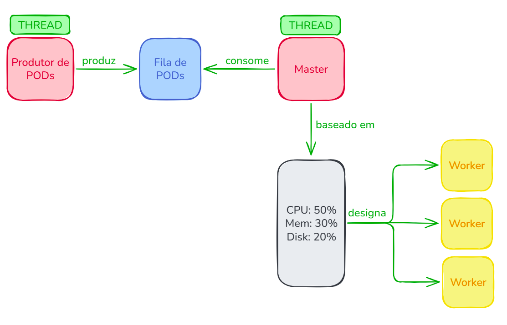

# Simulação de Escalonamento de PODs Kubernetes

Trabalho prático da disciplina de **Laboratório de Sistemas Operacionais — UNISINOS**.

Simula um ambiente com um nó **Master** e múltiplos nós **Workers**, onde PODs com diferentes requisitos computacionais são alocados por um escalonador customizado com **3 métricas**, e comparado com o escalonador padrão do Kubernetes (**2 métricas**).

---

## Como executar

### Pré-requisitos

- Python 3.10 ou superior

### Rodar

```bash
python main.py
```

---

## Estrutura do projeto

```
main.py               # Ponto de entrada: orquestra tudo
pod.py                # Classe Pod (requisitos + estado)
worker.py             # Classe Worker (recursos + alocação)
produtor_pods.py      # Thread Produtor: gera PODs e coloca na fila
master.py             # Thread Master/Consumidor: scheduler customizado
master_kubernetes.py  # Scheduler padrão do Kubernetes (comparação)
estatisticas.py       # Tabelas de resultado
```

---

## Arquitetura

<p align="center">
     
</p>

O `ProdutorPods` e o `Master` rodam em **threads separadas**, comunicando-se por uma **fila compartilhada**, o que representa uma implementação do paradigma **Produtor/Consumidor**.

---

## Algoritmo de escalonamento

### Escalonador Customizado — `master.py`

Usa **3 métricas** com pesos ponderados:

| Métrica           | Peso |
|-------------------|------|
| CPU disponível    | 50%  |
| Memória disponível| 30%  |
| Disco disponível  | 20%  |

```
score = (cpu_disp/cpu_total)*0.5 + (mem_disp/mem_total)*0.3 + (disk_disp/disk_total)*0.2
```

O POD é alocado no Worker com **maior score** que ainda tenha recursos suficientes.

### Escalonador Padrão do Kubernetes — `master_kubernetes.py`

Usa apenas **2 métricas**:

| Métrica           | Peso |
|-------------------|------|
| CPU disponível    | 50%  |
| Memória disponível| 50%  |

Não considera disco, ou seja, pode levar a alocações em workers com disco saturado.

---

## Saída da simulação

Ao final do `python main.py`, o programa exibe:

1. Log em tempo real do escalonamento (produtor/consumidor)
2. Tabela de PODs com status e worker alocado (escalonador customizado)
3. Tabela de Workers com recursos usados/disponíveis (escalonador customizado)
4. Estatísticas: taxa de sucesso, ocupação média, desequilíbrio
5. As mesmas 3 tabelas para o Kubernetes padrão

---

*UNISINOS — Análise e Aplicação de Sistemas Operacionais. João Vítor Loesch, 2026.*
